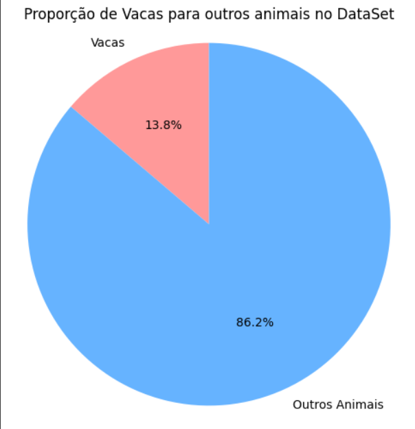
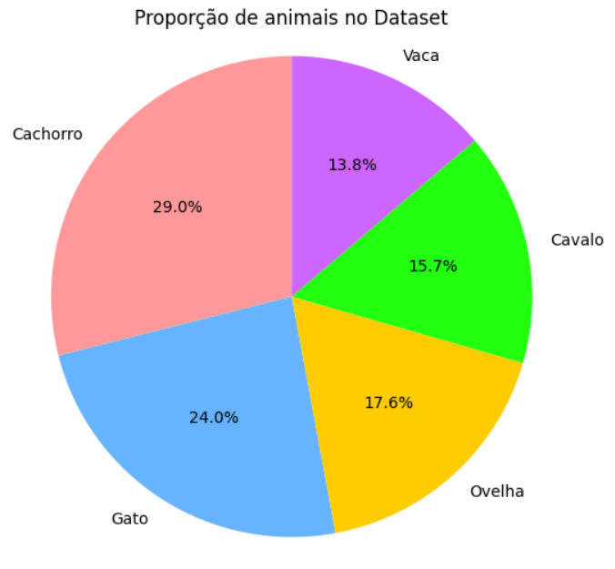
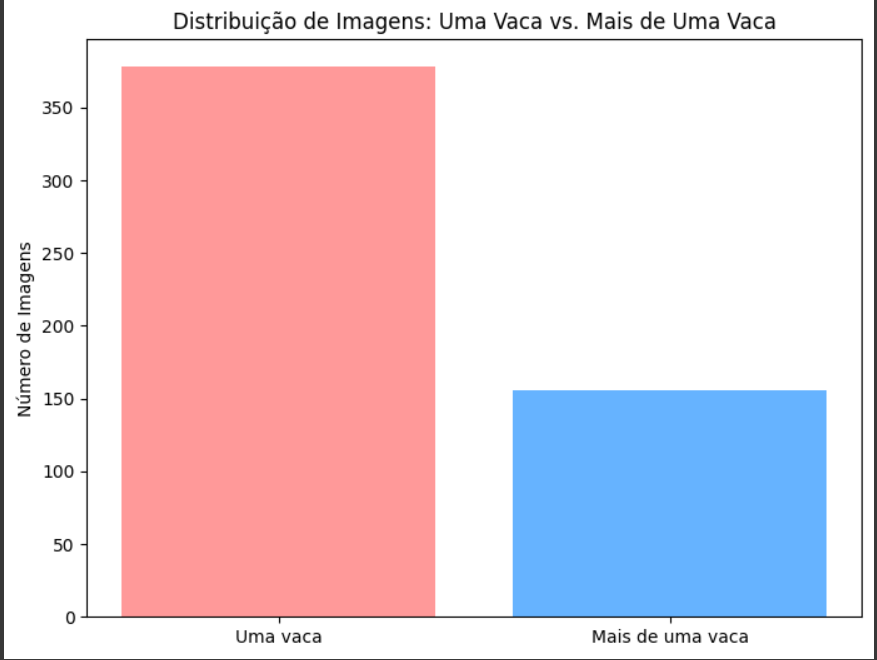
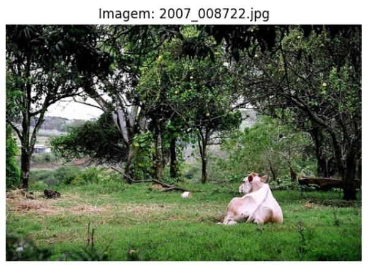
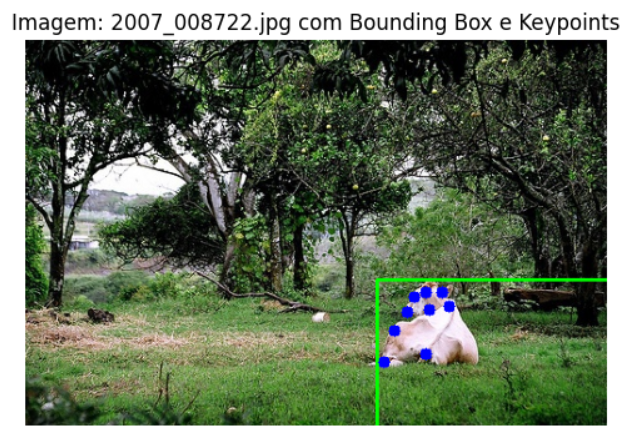
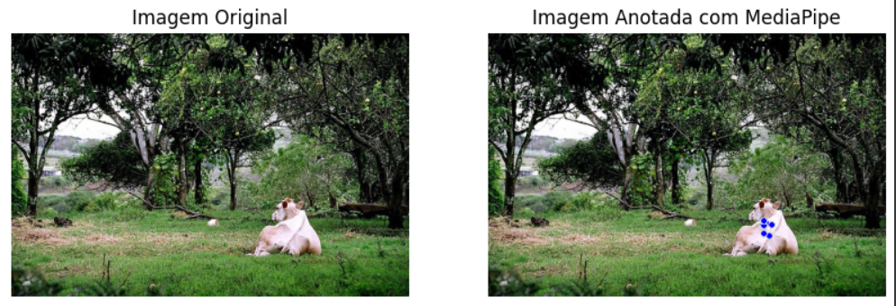
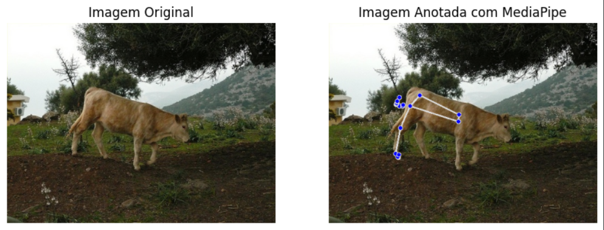
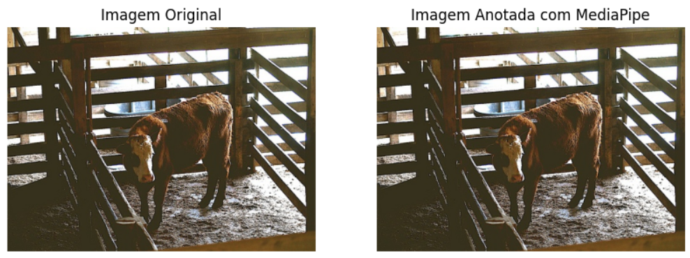
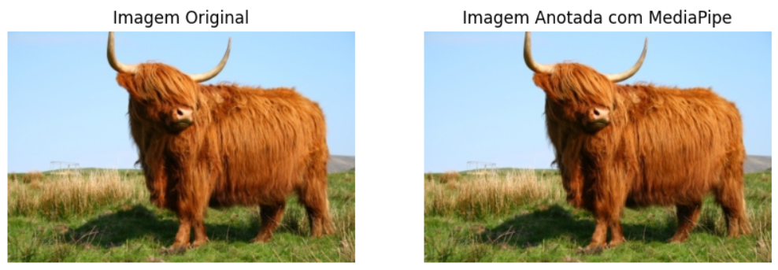
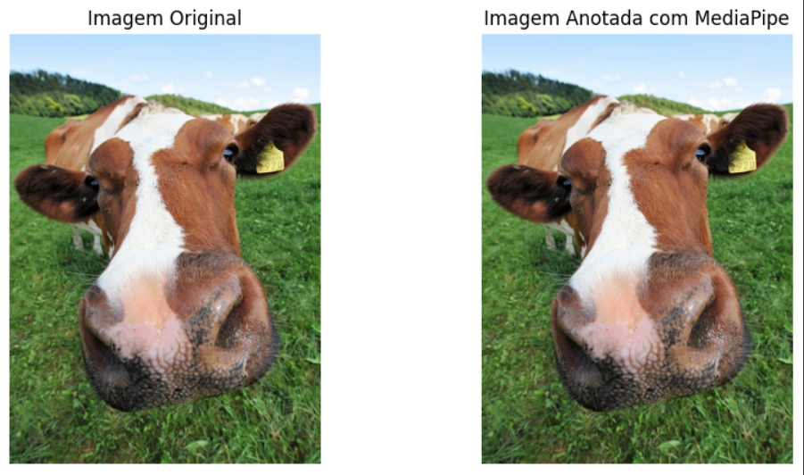

# Análise Exploratória
Para começar minha análise exploratória, instalei o dataset por meio desse [site](https://www.kaggle.com/datasets/bloodaxe/animal-pose-dataset).

Este dataset me trouxe basicamente as imagens e um json com todos os keypoints, bounding boxes, id de cada imagem e a qual categoria de animal ela pertencia.

Para poupar armazenamento, extrai as imagens dentro do meu colab e para tornar a manipulação dos dados mais simplificada, transformei o JSON em um Dataframe Pandas.

Após essa transformação, fiz algumas análises e explorei a base de dados para entender um pouco mais sobre ela.

A primeira análise que fiz foi a de quantas imagens de vacas haviam no dataset. Foi concluído que apenas 13,8% são imagens de vacas e os outros 86,2% são imagens de outros animais, como ovelhas e cachorros.

Para aprofundar um pouco mais, decidi fazer um gráfico que mostre a porcentagem de cada categoria presente no dataset. Para termos uma ideia de qual categoria animal mais possui imagens presentes na base de dados.

Foi visto que o cachorro é o animal mais presente na base, com 29%

Uma última análise que fiz em cima deste dataset diz respeito a proporção de imagens com um e mais de um boi no mesmo frame. Como meu interesse foi utilizar apenas imagens que possuiam um único boi, eu necessitei de ver se a proporção das imagens fazia sentido para adotar essa abordagem. Como vi que a proporção de imagens com apenas uma vaca era muito maior, segui com essa abordagem.

# Filtragem
A primeira filtragem do dataset original, que continha imagens de todas as categorias, foi feita para criar um novo dataset contendo apenas imagens de bovinos. Para isso, selecionei as imagens cujo category_id era igual a 5, gerando um novo DataFrame com essas imagens.

Em seguida, foi necessária uma segunda filtragem dentro desse dataset de bovinos, com o objetivo de obter apenas as imagens que continham uma única vaca. Isso foi feito utilizando o groupby do pandas, agrupando as imagens pelo image_id, o que permitiu criar um dataset contendo apenas imagens com um boi.

Uma imagem que extrai deste dataset filtrado:

E aqui temos um exemplo dessa mesma imagem com os Keypoints e a Bound Box desenhados nela.

No final, obtive 378 imagens com apenas uma vaca e 156 com mais de uma vaca. 

# Resultados Obtidos
No meu caso, os resultados da predição não foram tão expressivos. Ao prever 5 imagens, o MediaPipe conseguiu realizar a pose estimation em apenas 2 delas. Nessas duas imagens, embora alguns keypoints tenham sido gerados, eles ficaram incompletos e distantes do nível de detalhamento que seria alcançado em imagens de humanos, por exemplo.

# Minhas conclusões
O que posso concluir com essa atividade é que aprendi bastante sobre o funcionamento da pose estimation e sobre como aplicá-la em diferentes tipos de imagens. Compreendi os mecanismos internos da técnica, especialmente ao observar suas limitações e potencialidades. Embora a pose estimation seja amplamente utilizada em humanoides, tentar aplicá-la a bovinos foi uma experiência enriquecedora, pois me proporcionou insights valiosos sobre as dificuldades e as adaptações necessárias para aplicar essa técnica em não-humanos

A principal limitação que observei foi em relação ao desempenho do MediaPipe. Por ter sido treinado especificamente para realizar pose estimation em corpos humanos, o modelo teve dificuldades significativas para identificar corretamente as poses em bovinos. Isso ficou evidente tanto na baixa taxa de sucesso na identificação dos keypoints quanto na falta de precisão nos poucos casos em que ele conseguiu gerar estimativas.

Uma sugestão interessante para trabalhos futuros seria aplicar a técnica de transfer learning nesse modelo do MediaPipe. Com transfer learning, poderíamos aproveitar o que o modelo já aprendeu sobre a pose estimation em humanos e ajustá-lo para um novo contexto, utilizando um dataset específico de bovinos. Esse processo permitiria que o modelo fosse "afinando" suas capacidades e aprendesse a lidar melhor com as particularidades dos corpos dos bovinos.